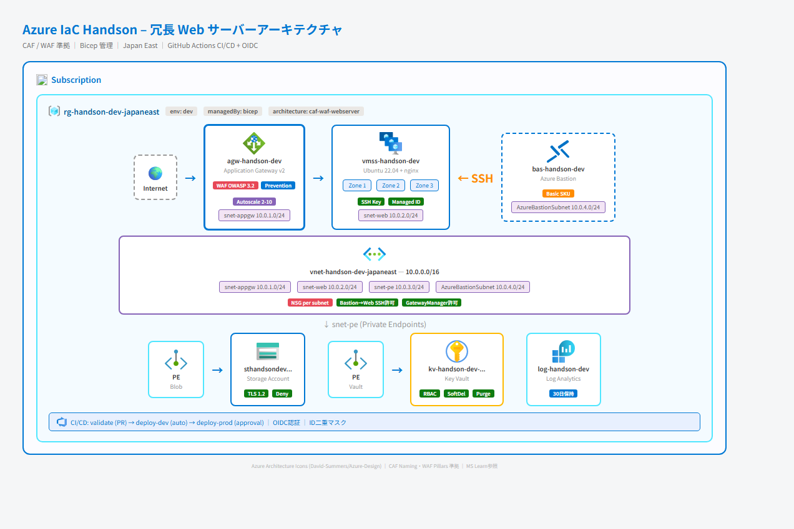

# Azure IaC Handson with SpecKit

SpecKit（仕様駆動開発）を活用した Azure Infrastructure as Code (Bicep) のハンズオンプロジェクトです。

---

## 📐 dev 環境アーキテクチャ（Bicep 管理）

> Azure Architecture Icons 使用 ([ガイドライン](https://learn.microsoft.com/en-us/azure/architecture/icons/))



### Bicep 管理リソース一覧（8リソース）

| リソース | 種別 (MS略称) | セキュリティ |
|---|---|---|
| `nsg-handson-dev-japaneast` | Network Security Group (`nsg`) | DenyAllInbound |
| `vnet-handson-dev-japaneast` | Virtual Network (`vnet`) | 2サブネット, NSG適用 |
| `sthandsondev...` | Storage Account (`st`) | TLS 1.2, Public Deny, PE付き |
| `kv-handson-dev-...` | Key Vault (`kv`) | RBAC認証, SoftDelete, PE付き |
| `pe-st*-blob` | Private Endpoint (`pep`) | Blob → snet-default |
| `pe-kv*-vault` | Private Endpoint (`pep`) | Vault → snet-default |
| PE NIC × 2 | Network Interface (`nic`) | PE用 |

> 命名規則は [MS Learn CAF Resource Abbreviations](https://learn.microsoft.com/en-us/azure/cloud-adoption-framework/ready/azure-best-practices/resource-abbreviations) に準拠

---

## ✅ セキュリティチェック

| チェック項目 | 結果 |
|---|---|
| NSG デフォルト DenyAllInbound | ✅ |
| Storage TLS 1.2 強制 | ✅ |
| Storage パブリックアクセス無効 | ✅ |
| Storage ネットワーク Deny + Private Endpoint | ✅ |
| Key Vault RBAC 認証 | ✅ |
| Key Vault Soft Delete (90日) + Purge Protection | ✅ |
| Key Vault ネットワーク Deny + Private Endpoint | ✅ |
| 全リソースにタグ付与 | ✅ |
| CI/CD で Azure ID マスク (二重防御) | ✅ |
| OIDC 認証 (長期クレデンシャルなし) | ✅ |

---

## 🔄 CI/CD パイプライン

| ワークフロー | トリガー | 環境 | 動作 |
|---|---|---|---|
| `validate` | PR → main (`infra/**`) | - | Bicep ビルド + What-If → PRコメント |
| `deploy-dev` | main push (`infra/**`) | dev (自動) | dev 環境へ自動デプロイ |
| `deploy-prod` | 手動トリガー | prod (承認必須) | What-If → 承認 → prod デプロイ |

- 認証: **OIDC フェデレーション**（長期シークレットなし）
- マスク: `::add-mask::` + `sed` による **二重防御**（パブリックリポジトリ対応）
- 並行制御: `concurrency` グループで同一環境のデプロイを直列化

---

## 📁 プロジェクト構成

```
handson-speckit/
├── infra/                          # Bicep IaC ファイル
│   ├── main.bicep                  # メインテンプレート（サブスクリプションスコープ）
│   ├── modules/                    # Bicep モジュール
│   │   ├── network.bicep           # VNet / サブネット / NSG
│   │   ├── storage.bicep           # ストレージアカウント + Private Endpoint
│   │   └── keyvault.bicep          # Key Vault + Private Endpoint
│   └── parameters/                 # 環境別パラメータ
│       ├── dev.bicepparam          # 開発環境
│       └── prod.bicepparam         # 本番環境
├── .github/
│   ├── workflows/                  # GitHub Actions CI/CD
│   │   ├── bicep-validate.yml      # PR バリデーション
│   │   ├── deploy-dev.yml          # dev 自動デプロイ
│   │   └── deploy-prod.yml         # prod 承認付きデプロイ
│   ├── agents/                     # SpecKit エージェント（日本語）
│   └── prompts/                    # SpecKit プロンプト
├── specs/                          # SpecKit 仕様
│   ├── 001-azure-foundation/       # Azure 基盤仕様
│   └── 001-github-actions-deploy/  # CI/CD パイプライン仕様
├── scripts/deploy.ps1              # ローカルデプロイスクリプト
├── .specify/                       # SpecKit 設定・テンプレート
└── .gitignore
```

---

## 🚀 クイックスタート

### 前提条件

- Azure CLI (`az`) + Bicep
- SpecKit CLI (`specify`) — `uv tool install specify-cli --from git+https://github.com/github/spec-kit.git`
- Python 3.12+

### ローカルデプロイ

```powershell
# バリデーション
.\scripts\deploy.ps1 -Environment dev -Validate

# What-If 分析
.\scripts\deploy.ps1 -Environment dev -WhatIf

# デプロイ
.\scripts\deploy.ps1 -Environment dev
```

### SpecKit ワークフロー

```
/speckit.specify  → 仕様作成
/speckit.clarify  → 曖昧さ解消
/speckit.plan     → 技術計画
/speckit.tasks    → タスク生成
/speckit.implement → 実装
```

---

## 🏷️ 命名規則

[MS Learn CAF](https://learn.microsoft.com/en-us/azure/cloud-adoption-framework/ready/azure-best-practices/resource-abbreviations) 準拠

| リソース種別 | 形式 | 例 |
|---|---|---|
| Resource Group | `rg-{project}-{env}-{region}` | `rg-handson-dev-japaneast` |
| VNet | `vnet-{project}-{env}-{region}` | `vnet-handson-dev-japaneast` |
| NSG | `nsg-{project}-{env}-{region}` | `nsg-handson-dev-japaneast` |
| Storage | `st{project}{env}{unique}` | `sthandsondevxxxx` |
| Key Vault | `kv-{project}-{env}-{unique}` | `kv-handson-dev-xxxx` |
| Private Endpoint | `pe-{resource}-{subresource}` | `pe-st*-blob` |
